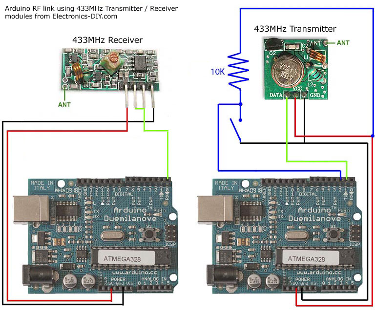

### Link to [Arduino](https://www.arduino.cc/https://www.arduino.cc/) site.

#### What is Arduino?

*Arduino is an open-source electronics platform based on easy-to-use hardware and software. Arduino boards are able to read inputs - light on a sensor, a finger on a button, or a Twitter message - and turn it into an output - activating a motor, turning on an LED, publishing something online. You can tell your board what to do by sending a set of instructions to the microcontroller on the board. To do so you use the Arduino programming language (based on Wiring), and the Arduino Software (IDE), based on Processing.*

If you want more details, please, click [here.](https://www.arduino.cc/en/Guide/Introduction)

## Getting Started

First of all, the Arduino software is easy-to-use for beginners, yet flexible enough for advanced users. It runs on Mac, Windows, and Linux (I personally prefer Linux, it's a excellent platform). Teachers and students use it to build low cost scientific instruments, to prove chemistry and physics principles, or to get started with programming and robotics.

In this project, I used two Arduinos [Uno R3](https://store.arduino.cc/arduino-uno-rev3)

##### Install the Arduino IDE:

The first step to programming is to install the Arduino IDE.

It's very simple, look the [site](https://www.arduino.cc/en/Main/Software) have a excellent tutorial for you learn step by step, how to install the IDE.

#### Libraries needed.

After you install the IDE, you need to import the library in this project, I used the [VirtualWire](http://www.airspayce.com/mikem/arduino/VirtualWire/VirtualWire-1.27.zip) the documentation you will find in this [link](https://www.pjrc.com/teensy/td_libs_VirtualWire.html).

I used that library to facilitate the implementation of the **RF 433Mhz transmitter-receiver Module**

#### The list of materials you need to create this project:

- 2 - Arduino Uno R3;
- 2 - Protoboard;
- 1 - RF 433Mhz transmitter-receiver Module;
- 2 - Battery 9V (Optional);
- 2 - Battery adapters (Optional);
- 1 - Resistor of 220 Ohms;
- 1 - LED PTH
- 12 - Jumpers;

### RF433mhz Module

Below, you will find the information you may need about RF433Mhz Module and a example.

**RF Transmitter/Receiver Module Pinout.**

### Credits for this project

This project is the result of a global cooperative effort on the part of many partners, for example:

 - Google;
 - Prof. Carlos Fabri
 - Gabriel Novaes Pessigello
 - [Marcos Moura](https://www.linkedin.com/in/marcos-moura-22238b105)
 - Daniel Fontana (English Revision)

### References ###

  - [Arduino](https://www.arduino.cc/)
  - [Transmitter and Receiver RF433Mhz Module](https://www.pjrc.com/teensy/td_libs_VirtualWire.html)
  - [VirtualWire Lib](https://www.pjrc.com/teensy/td_libs_VirtualWire.html)
  - [Components](https://www.googleadservices.com/pagead/aclk?sa=L&ai=DChcSEwilr6jdi_TXAhVFgJEKHU4FA1IYABAIGgJjZQ&ohost=www.google.com.br&cid=CAESEeD2i1POhdG0cASuDiqL_N03&sig=AOD64_22oKjpmyoDaCp5BxeiXaWFfCNRVg&ctype=5&q=&ved=0ahUKEwir6Zndi_TXAhXBkpAKHaTPAzkQ9aACCDU&adurl=)
